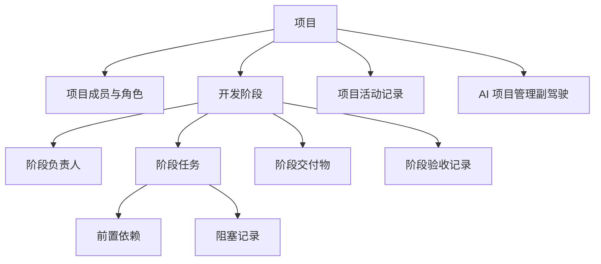

# 启咨 Qizī

> **启事以明，咨疑以达**

启咨是一款面向 3-20 人软件研发团队的开发项目管理工具。它打破「PM 单向下发任务」的传统模式：任务发起方 **启** 动需求，执行方可以反向 **咨** 问发起方——澄清需求、质询排期、提出异议，需求与执行双向对齐、权责互见。

## 品牌故事

「咨」出自《尚书》「咨尔庶众」，上古君王分派事务之时，允许臣下咨问。启咨继承了这种双向议事的传统：

- **启** —— 发起任务：PM 定义需求目标、阶段框架与排期规则；
- **咨** —— 反向问询：执行者可以就需求的可行性、排期风险与隐藏歧义直接向发起方质询澄清。

传统项目管理工具是「重」单向发令，启咨让规划与执行双向互通：PM 可提需求，技术可反向质询需求合理性、反馈排期风险，两端同频对齐后再落地。

## 核心特性

- **任务双向，询而后衡**：执行者不是被动接活，而是可以主动问询发起方，澄清需求、校正预期，避免错做、少做与返工。
- **以阶段为骨架**：项目以开发阶段组织工作，默认模板为需求分析 → 技术设计 → 开发 → 测试 → 发布，主阶段与并行阶段并行推进。
- **执行闭环可见**：阶段任务、依赖、阻塞、交付物与验收形成完整闭环，每个环节的负责人与处理记录都透明可溯。
- **AI 项目管理副驾驶**：实时读取项目数据，生成状态摘要、识别阶段风险、给出行动建议，辅助团队持续掌握项目推进状态。

## 功能总览

| 模块 | 说明 | 状态 |
|---|---|---|
| 项目成员与权限 | 项目负责人 / 阶段负责人 / 项目成员 / 观察者，按角色控制数据访问范围 | ✅ 已实现 |
| 项目阶段管理 | 阶段模板、阶段结构、阶段负责人、主阶段与并行阶段规则、状态流转 | ✅ 已实现 |
| 阶段任务管理 | 阶段内任务创建/推进、跨阶段移动、状态流转校验、跨项目「我的任务」 | ✅ 已实现 |
| 任务依赖与阻塞 | 前置依赖（循环依赖校验）、任务/阶段阻塞、解除与确认流程 | ✅ 已实现 |
| 阶段交付物与验收 | 交付物管理、必需项标记、提交 / 确认 / 驳回验收、重开已完成阶段 | 🚧 开发中 |
| 项目总览与活动 | 项目状态自动计算、主阶段优先展示、风险区、活动记录追溯 | 🚧 开发中 |
| AI 项目管理副驾驶 | 项目状态摘要、阶段风险分析、个人行动建议、管理问答、近期变化回顾 | 🚧 开发中 |

> 详细进度与任务清单见 [TODO.md](./TODO.md)。

## 领域模型



**阶段状态机：** `未开始 → 进行中 ↔ 受阻 → 待验收 → 已完成`

- 待验收被驳回后回到进行中；已完成阶段默认只读。
- 存在进行中、受阻或待验收阶段时，项目必须有且只有一个主阶段，其余为并行阶段。

## 技术栈

| 端 | 技术 |
|---|---|
| 后端 | FastAPI + SQLAlchemy 2.0 + SQLite + Pydantic v2，uv 管理依赖（Python ≥ 3.11），loguru JSON 日志 |
| 前端 | React + Vite + TypeScript + antd 6 + recharts + lucide-react |
| 测试 | pytest + httpx（后端） |

## 项目结构

```
backend/                 # FastAPI 后端
  app/
    main.py              # 应用工厂、生命周期与中间件
    core/                # 配置、身份、日志
    db/                  # SQLAlchemy ORM、会话与建表
    domains/             # 领域逻辑（任务等）
    routers/             # HTTP 端点
    schemas/             # Pydantic 请求/响应模型
    services/            # 业务服务层
  tests/                 # 后端测试
frontend/                # React 前端工作台
  src/
    api/                 # API 客户端
    components/          # 看板、燃起图、范围时间线等
    hooks/               # 数据加载与状态 hooks
    types/               # 类型定义
openspec/                # OpenSpec 规格与变更
prd/                     # 产品需求文档
```

## 快速开始

### 后端

```bash
cd backend
uv sync
uv run uvicorn app.main:app --log-config logging_config.json --reload --port 8000
```

前端默认连接 `http://localhost:8000/api`。

### 前端

```bash
cd frontend
npm install
npm run dev
```

### 测试

```bash
# 后端（backend/ 目录下）
uv run pytest

# 前端构建（frontend/ 目录下）
npm run build
```

## 配置

| 环境变量 | 默认值 | 说明 |
|---|---|---|
| `VIBE_PM_DB_PATH` | `vibe_pm.db`（相对路径） | SQLite 数据库文件路径，测试可用临时文件 |
| `VIBE_PM_CORS_ORIGINS` | 空 | 逗号分隔的 CORS 允许来源 |
| `VIBE_PM_LOG_DIR` | `/var/log/vibe-pm` | 日志目录（JSON 行格式） |
| `VITE_API_BASE_URL` | `http://localhost:8000/api` | 前端 API 地址 |
| `VITE_USER_ID` | 无 | 前端开发身份 |

## Roadmap

- [x] 项目成员与权限
- [x] 项目阶段管理
- [x] 阶段任务管理
- [x] 任务依赖与阻塞
- [ ] 阶段交付物与验收
- [ ] 项目总览与活动
- [ ] AI 项目管理副驾驶

## 项目背景

启咨的诞生源于研发流程中的真实痛点：需求在开发过程中时常被变更，PRD 文档对部分细节又描述不清，两者都容易直接导致开发延期。

### 痛点一：PRD 细节缺失，开发到一半才发现

PRD 常常只写「实现登录功能」，却不交代密码规则、错误提示文案、第三方登录范围等细节。开发进行到一半才发现缺失，只能停下找 PM 澄清、返工甚至重写，工期被悄悄拉长。

> 例如：PRD 只写了「订单支持导出」，开发按全量字段实现后，PM 才补充「仅导出已完成订单、需权限校验、文件上限 10 万行」，一次返工多耗数天。

### 痛点二：开发过程中需求被变更

产品在迭代中调整需求是常态，但变更如果只发生在口头或即时通讯里，开发人员接到的任务与实际需求就会脱节。

> 例如：支付流程原本「下单即支付」，评审后改为「下单后 30 分钟内支付」；任务已经开发一半，排期与依赖全部被打乱，延期随之而来。

### 传统工具的局限

传统项目管理工具只追踪任务本身的状态——谁在做、做到哪一步。它们很难回答一个关键问题：**这次延期究竟因何而起？** 需求变更和 PRD 描述不完整这两类「源头性」原因，往往消失在口头沟通里，事后复盘无据可查。

### 启咨的做法

启咨把 PM 的每个需求与 PRD 的变更也纳入追踪，连同执行层的任务、依赖与阻塞一起沉淀为可追溯的活动记录。于是延期原因可以从更多维度分析：

- **需求维度**：该功能的需求在开发期间变更过几次、每次改了什么；
- **文档维度**：PRD 是否在开发开始前就完整、细节是否滞后补充；
- **执行维度**：任务是否因依赖、阻塞、无人负责而停滞。

> 例如：复盘发现某次延期主因是「PRD 未写明权限校验」，那么在后续项目里，阶段验收前会专门核对 PRD 细节完整性，从源头减少同类延期。

把延期从「凭感觉」变成「有数据」，团队就能在后续开发中有针对性地减少类似问题。
 
