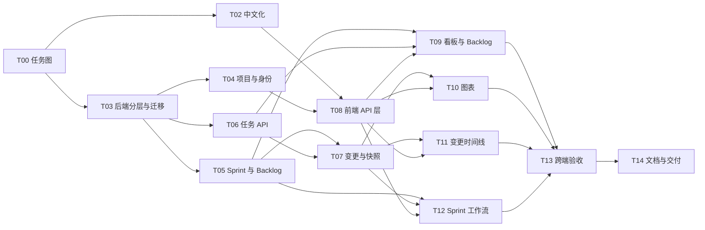

# Vibe PM MVP-1 任务图

> 更新时间：2026-08-07  
> 执行原则：前端与后端分别使用独立 Git 仓库；只有通过对应验收标准的任务才能标记为完成。  
> 状态说明：`[x] 已完成`、`[ ] 待开始`、`[-] 进行中`、`[!] 阻塞`。

## 当前进度

- [x] T00：完成 MVP-1 任务拆分与依赖建模
- [x] T01：建立 React 工作台与 FastAPI 演示原型
- [x] T02：将全部用户界面和演示数据中文化
- [x] T03：建立后端分层结构和数据库迁移基础
- [x] T04：实现项目、成员与身份上下文
- [x] T05：实现 Sprint 生命周期与 Backlog API
- [x] T06：实现任务 CRUD、排序和状态流转 API
- [x] T07：实现范围变更事务与快照计算服务
- [x] T08：建立前端 API 客户端与服务端状态管理
- [x] T09：接通 Sprint 看板、任务详情和 Backlog
- [x] T10：接通燃起图、燃尽图和图表交互
- [x] T11：接通 Scope Change Timeline 和变更流程
- [x] T12：实现 Sprint 创建、开始和结束工作流
- [x] T13：完成跨端验收、错误状态和回归测试
- [x] T14：补齐运行文档、环境配置和独立仓库交付

## 依赖图

## 并行波次

| 波次 | 可并行任务 | 最大并行度 | 开始条件 |
|---|---|---:|---|
| Wave 0 | T02、T03 | 2 | T00 已完成 |
| Wave 1 | T04、T05、T06 | 3 | T03 已完成 |
| Wave 2 | T07、T08 | 2 | T02、T04、T05、T06 已完成 |
| Wave 3 | T09、T10、T11、T12 | 3 | 各任务依赖分别满足；T09/T10/T11 前端文件范围需隔离 |
| Wave 4 | T13 | 1 | T09-T12 全部完成 |
| Wave 5 | T14 | 1 | T13 完成 |

前端任务会在 `frontend` 仓库中按组件和功能目录隔离；后端任务会在 `backend` 仓库中按领域模块隔离。若两个并行任务需要修改同一入口文件，入口接线延后到该波次的汇合步骤处理，避免覆盖。

## 任务详情

### [x] T00：完成 MVP-1 任务拆分与依赖建模

- 类型：文档 / 架构规划
- 依赖：无
- 修改范围：`TASK_GRAPH.md`
- 实现方式：
  1. 根据 PRD 的 F1-F4、数据模型、API 和验收标准拆分可独立交付的节点。
  2. 为每个节点标记前置依赖和预计修改目录。
  3. 检查循环依赖、悬空依赖和并行文件冲突。
  4. 使用拓扑排序形成执行波次，并设置每波次的并发上限。
- 验收标准：任务无循环依赖；每个任务都有实现步骤、验收标准和修改范围；可明确判断何时更新为完成。

### [x] T01：建立 React 工作台与 FastAPI 演示原型

- 类型：全栈原型
- 依赖：无
- 修改范围：`frontend/`、`backend/`
- 已实现：React Sprint 工作台、静态燃起图/燃尽图、看板拖拽、任务抽屉、FastAPI SQLite 演示接口、两个独立 Git 仓库。
- 完成依据：前端生产构建通过；后端基础测试通过；两端开发服务可启动。
- 限制：前端仍使用本地演示状态，后端尚未分层，不能视为完整 MVP-1。

### [x] T02：将全部用户界面和演示数据中文化

- 类型：前端 / UI
- 依赖：T00
- 修改范围：`frontend/src/main.tsx`、必要的中文排版样式
- 实现方式：
  1. 枚举导航、按钮、图表图例、状态、筛选、抽屉、弹窗、Tooltip、辅助说明和无障碍标题中的英文文本。
  2. 将 Sprint 状态、任务状态和标签建立为集中式中文映射，内部枚举值保持英文以兼容 API。
  3. 将日期、故事点、天数和百分比按中文阅读习惯格式化。
  4. 调整中文字体栈、按钮宽度和紧凑区域布局，保证文字不截断、不重叠。
  5. 构建生产包并在桌面与窄屏尺寸检查页面。
- 验收标准：界面没有面向用户的英文文案；内部字段名不泄漏；`npm run build` 通过；浏览器访问页面正常。

### [x] T03：建立后端分层结构和数据库迁移基础

- 类型：后端 / 基础设施
- 依赖：T00
- 修改范围：`backend/app/core/`、`backend/app/db/`、`backend/app/models/`、迁移配置、测试夹具
- 实现方式：
  1. 将单文件应用拆为配置、数据库会话、领域模型、Schema、Service 和 Router 层。
  2. 使用环境变量配置数据库 URL、CORS 和运行模式，保留 SQLite 本地开发能力。
  3. 建立可重复执行的迁移，覆盖 projects、profiles、project_members、sprints、tasks、scope_changes、sprint_snapshots 及索引。
  4. 增加测试数据库夹具，确保测试不会污染开发数据。
  5. 保留 `/api/health` 并提供统一错误响应格式。
- 验收标准：空数据库可迁移后启动；模型约束与 PRD 一致；测试数据库可隔离重建；旧单文件逻辑完成迁移。

### [x] T04：实现项目、成员与身份上下文

- 类型：后端
- 依赖：T03
- 修改范围：项目、成员、身份依赖模块及对应测试
- 实现方式：
  1. 实现项目创建、详情和成员列表接口。
  2. MVP 本地模式使用请求头或开发身份依赖提供当前用户，业务代码不得写死 `current-user`。
  3. 对所有项目资源校验成员关系，阻止跨项目访问。
  4. 为后续 Supabase Auth 预留身份适配接口，不在 MVP 中耦合具体云服务。
- 验收标准：项目成员可访问自己的项目；非成员返回 403；变更记录能写入真实操作人。

### [x] T05：实现 Sprint 生命周期与 Backlog API

- 类型：后端
- 依赖：T03
- 修改范围：Sprint、Backlog 路由与服务、测试
- 实现方式：
  1. 实现 Sprint 创建、列表、详情和 planning→active→completed 状态机。
  2. 校验日期范围和同项目只允许一个 active Sprint。
  3. 开始 Sprint 时固化 `initial_points` 并生成首条快照。
  4. 结束 Sprint 时统计完成点数、完成率和变更次数，将未完成任务移回 Backlog。
  5. 提供 Backlog 列表及任务移入/移出 Sprint 的领域操作。
- 验收标准：非法状态跃迁返回 409；开始和结束行为原子执行；未完成任务结束时回到 Backlog。

### [x] T06：实现任务 CRUD、排序和状态流转 API

- 类型：后端
- 依赖：T03
- 修改范围：任务路由、Schema、Service、测试
- 实现方式：
  1. 实现任务创建、查询、修改、删除，并校验故事点只能为 1/2/3/5/8/13。
  2. 实现四种状态流转、负责人、优先级和列内 position 排序更新。
  3. 状态变成 done 时写入 `completed_at`，离开 done 时清空。
  4. 对 active Sprint 内会改变范围的操作交给范围变更服务处理，禁止绕过审计。
  5. 对并发修改增加更新时间或版本校验，避免静默覆盖。
- 验收标准：字段校验完整；拖拽更新可持久化；完成时间正确；active Sprint 范围变化不能无日志发生。

### [x] T07：实现范围变更事务与快照计算服务

- 类型：后端 / 核心领域
- 依赖：T05、T06
- 修改范围：范围变更、快照服务与路由、测试
- 实现方式：
  1. 建立 add_task、remove_task、change_points 三种领域命令，在一个事务内修改任务、写 scope_changes、upsert 当日快照。
  2. 按 todo=0、in_progress=0.5、in_review=0.8、done=1 计算已完成点数。
  3. 生成 total_scope、completed_points、remaining_points 和理想进度值。
  4. 保证历史快照不可被任务删除回写；同一天只保留最新状态，同时保留所有变更日志。
  5. 提供幂等的每日快照生成入口，供定时任务调用。
  6. 返回初始范围增加超过 20% 的容量警告。
- 验收标准：三个变更场景均有事务测试；失败时无半写入；图表数据与任务状态一致；重复生成同日快照不产生重复行。

### [x] T08：建立前端 API 客户端与服务端状态管理

- 类型：前端 / 基础设施
- 依赖：T02、T04
- 修改范围：`frontend/src/api/`、`frontend/src/hooks/`、环境变量和通用反馈组件
- 实现方式：
  1. 建立带类型的 API Client，集中配置 base URL、当前身份请求头、JSON 解析和错误映射。
  2. 把 Sprint 详情、任务、变更和快照查询封装为独立 Hook。
  3. 为写操作实现 loading、错误提示、成功后刷新和必要的乐观更新回滚。
  4. 增加首屏加载、空数据、断网和 API 失败状态。
  5. 移除组件内硬编码业务数据，演示数据仅允许在明确的开发降级模式中使用。
- 验收标准：切换 API 地址无需改代码；所有请求有可见反馈；网络失败不会留下错误的本地状态。

### [x] T09：接通 Sprint 看板、任务详情和 Backlog

- 类型：前端 / 功能
- 依赖：T05、T06、T08
- 修改范围：看板、任务抽屉、Backlog 页面或组件
- 实现方式：
  1. 使用后端任务列表渲染四列看板，拖拽后调用状态和排序接口。
  2. 新建、编辑、删除任务均接入 API，并在失败时恢复原位置。
  3. 任务详情支持标题、描述、故事点、优先级和负责人编辑。
  4. 实现 Backlog 列表及拖入/拖出 Sprint 操作。
  5. 对 active Sprint 的点数修改或移出操作打开原因确认流程。
- 验收标准：刷新页面后操作结果仍存在；拖拽失败能回滚；Backlog 与 Sprint 任务不会重复出现。

### [x] T10：接通燃起图、燃尽图和图表交互

- 类型：前端 / 数据可视化
- 依赖：T07、T08
- 修改范围：图表组件、Tooltip、变更详情弹层
- 实现方式：
  1. 从 snapshots 和 scope_changes 组装燃起图数据，范围线使用阶梯线，完成线使用平滑面积线。
  2. 计算并展示理想进度线；燃尽视图展示实际剩余和理想剩余。
  3. 在范围跳变日期显示增减标记，悬停展示当天范围、完成量和变更摘要。
  4. 点击标记打开完整变更详情，并可定位关联任务。
  5. 图表下方摘要全部从 API 数据计算，不保留硬编码数字。
- 验收标准：新增、移除和改点后图表实时变化；两种视图数据正确；无数据和单日数据可正常渲染。

### [x] T11：接通 Scope Change Timeline 和变更流程

- 类型：前端 / 核心功能
- 依赖：T07、T08
- 修改范围：变更时间线、新增需求、移出需求、改点确认组件
- 实现方式：
  1. 时间线按 created_at 倒序展示类型、描述、点数、原因和操作人。
  2. “加需求”表单通过范围变更命令创建任务并加入 Sprint。
  3. 移出 Sprint 时要求选择预设原因或填写其他原因。
  4. 修改点数时展示旧值、新值和差值，并允许填写原因。
  5. 当后端返回容量警告时显示非阻断提醒。
- 验收标准：三种操作均只产生一条对应日志；时间线刷新后保留；容量警告不阻止提交。

### [x] T12：实现 Sprint 创建、开始和结束工作流

- 类型：前端 / 功能
- 依赖：T05、T07、T08
- 修改范围：Sprint 表单、状态操作、结束确认与结果摘要
- 实现方式：
  1. 创建表单支持名称、目标、起止日期和 Backlog 任务选择。
  2. planning 状态展示总点数，并在有历史速度时显示对比；超出容量只警告。
  3. 开始 Sprint 前展示初始范围确认，成功后进入 active 工作台。
  4. 结束 Sprint 前展示完成数据和未完成任务清单；确认后展示归档摘要。
  5. 根据状态限制编辑能力并解释不可用原因。
- 验收标准：完整完成创建→规划→开始→执行→结束；状态按钮与后端状态一致；结束摘要数字正确。

### [x] T13：完成跨端验收、错误状态和回归测试

- 类型：测试 / 集成
- 依赖：T09、T10、T11、T12
- 修改范围：前后端测试、测试数据工厂、端到端脚本
- 实现方式：
  1. 后端覆盖状态机、范围变更事务、快照公式、权限和异常回滚。
  2. 前端覆盖看板拖拽、表单校验、图表切换、时间线和 API 失败回滚。
  3. 端到端执行 PRD 的首次使用、Day 3 加需求、Day 5 完成任务和 Sprint 结束旅程。
  4. 检查桌面和窄屏布局无文本重叠；验证页面加载与图表渲染时间。
  5. 运行前端构建、后端测试和 API 健康检查。
- 验收标准：关键用户旅程全部通过；没有阻断级缺陷；构建与测试命令全绿；已知限制记录在交付文档。

### [x] T14：补齐运行文档、环境配置和独立仓库交付

- 类型：文档 / 交付
- 依赖：T13
- 修改范围：两个仓库的 README、示例环境变量、Git 提交
- 实现方式：
  1. 分别说明前端和后端的安装、启动、测试、构建与环境变量。
  2. 提供本地联调顺序、默认端口、API 文档地址和数据库初始化方式。
  3. 确认生成物、数据库和密钥文件已被各自 `.gitignore` 排除。
  4. 分别检查两个仓库的工作区和提交历史，保证没有跨仓库依赖文件被误提交。
  5. 记录 MVP-1 已实现范围与 MVP-2 明确不包含的内容。
- 验收标准：新环境按 README 可运行；两个 Git 仓库工作区干净；最终交付清单与实际功能一致。

## 状态更新规则

1. 开始任务时把 `[ ]` 改成 `[-]`，并同步更新“当前进度”。
2. 只有代码、测试、浏览器验证和对应 Git 提交都完成后，才能改为 `[x]`。
3. 任务失败时标记 `[!]`，写明阻塞原因；所有依赖该任务的节点同时保持阻塞。
4. 每个并行波次必须全部结束后再进入下一波次；波次结束时重新检查是否出现新依赖。
5. 前端每项业务改动完成并可访问后，需要用户在浏览器确认效果，确认前不将 UI 节点标记为最终完成。
